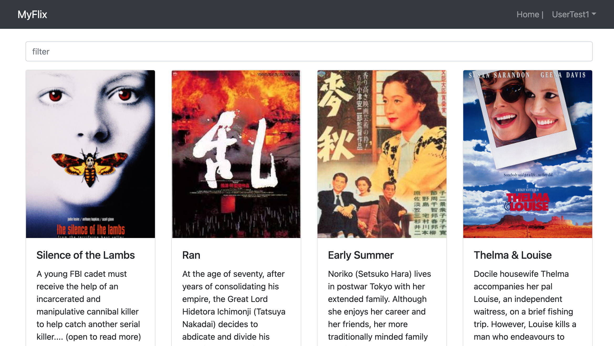

This App is the Client side of the myFlix App.
It makes use of React Library.

1. Project description
   This App is the Client side of the myFlix API. (see below for details regarding the REST API and database)

It makes use of React Library as well as Redux.

2. User Stories

- User will be able to access information on movies, directors, and genres so that he
  can learn more about movies he watched or is interested in.

- User will to be able to create a profile so he can save data about his favorite movies.

3. How to get the project running
   This App can be executed from the terminal usng the following command: **parcel src/index.html**

4. Project main dependencies (e.g., JavaScript version, ESLint rules)

   - "axios": "^0.27.2",
   - "prop-types": "^15.8.1",
   - "react": "^18.2.0",
   - "react-bootstrap": "^2.5.0",
   - "react-dom": "^18.2.0",
   - "react-redux": "^8.0.2",
   - "react-router-dom": "^5.3.0",
   - "redux": "^4.2.0",
   - "redux-devtools-extension": "^2.13.9"

5. API used by the project

- myFlix API: https://github.com/xavsln/myFlix_v20220621-1
